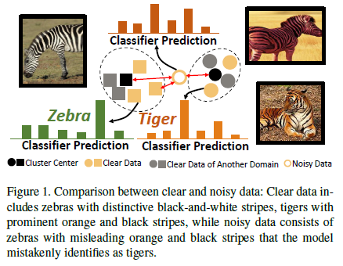
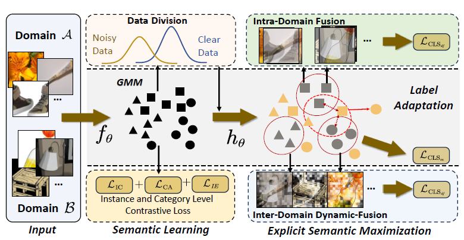
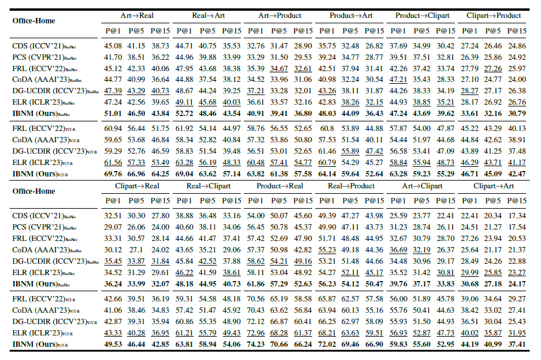
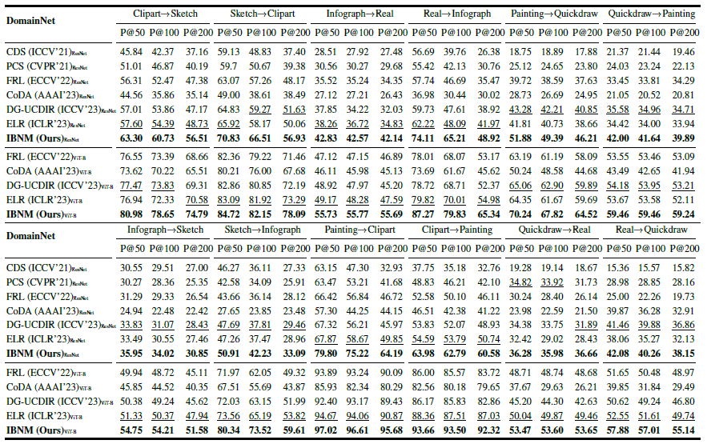

# IBNM : Information-Based Noisy Mitigation for Unsupervised Cross-Domain Image Retrieval
<!-- ## Preparation:
```python
pip3 install torch torchvision torchaudio --extra-index-url https://download.pytorch.org/whl/cu116

python3 -m pip uninstall tutel -y
python3 -m pip install --user --upgrade git+https://github.com/microsoft/tutel@main

pip3 install -r requirements.txt
``` -->

## Datasets:
[Office-Home](https://www.hemanthdv.org/officeHomeDataset.html)
[PACS](https://drive.google.com/drive/folders/0B6x7gtvErXgfUU1WcGY5SzdwZVk?resourcekey=0-2fvpQY_QSyJf2uIECzqPuQ)
[DomainNet](http://ai.bu.edu/M3SDA/)
## Pre-trained model
[MoCo v2](https://github.com/facebookresearch/moco)
[Dino-B/16](https://dl.fbaipublicfiles.com/dino/dino_vitbase16_pretrain/dino_vitbase16_pretrain.pth)
## Environments:
```python
Python: 3.9.18
    - faiss-gpu==1.7.2
    - timm==0.9.7
    - tqdm==4.66.1
    - wandb==0.15.12
    - pytorch=2.1.0=py3.9_cuda12.1_cudnn8.9.2_0
    - torchvision=0.16.0=py39_cu121
```
## Train a model:
```python
    ./scripts/office-home.sh
    ./scripts/pacs.sh
    ./scripts/domainnet.sh
```


## Cross-Domain Dynamic Fusion
### Overview of MSA in Vision Transformer
Before delving into the detailed explanation of our Dynamic Data Fusion coefficient construction strategy, let's first review the multi-head self-attention (MSA) mechanism in Visual Transformer.
Given an image $I \in \mathbb{R}^{c \times h \times w}$, we can tokenize it into a sequence of visual tokens by using the same approach proposed in ViT where images are evenly partitioned into non-overlapping patches, followed by a projection head mapping it into $X' = [v_1, v_2, ..., v_n] \in \mathbb{R}^{n \times d}$, where $n$ and $d$ are the number and the dimension of the flatten patches, respectively.
Additionally, a class token $Cls$ is added in the tokens $X = [Cls, v_1, v_2, ..., v_n]$ to facilitate the semantic learning by capturing a global representation of an image.
During the model inference, all visual tokens interact with each other through the multi-head self-attention (MSA) modules, followed by an MLP block. In formal terms, the overall forward is as follows:

$$X_l = MSA(LN(X_{l-1})) + X_{l-1}; l = 1, ..., L$$

$$X_l = MLP(LN(X_l)) + X_l; l = 1, ..., L$$

where $\text{LN}()$ is layer norm and $L$ is the number of blocks.
Specifically, the MSA module has three different projection heads $[W_q; W_k; W_v]$, which map the same token embeddings into Queries, Keys, and Values ($Q, K, V \in \mathbb{R}^{n \times d}$). Formally, it is formulated as:

$$Q = V_i * W_q$$

$$K = V_i * W_k$$

$$V = V_i * W_v$$

Then the scaled dot-product attention is given by $s\text{-}attn(Q, K, V) = \text{softmax}(\frac{QK^\mathtt{T}}{\sqrt{d}})V$.

### The Dynamic Data Fusion Coefficients
In cross-domain retrieval tasks, there is significant variation in information density between different domains, such as sketches and real-world images. This is manifested in real-world images having more complex and blurred grayscale variations and more noise compared to sketches. Hence, in the data fusion process, it is essential to provide image weights based on the information density of different image parts.

For the $i$-th patch $v_i$ of an instance $X$, we utilize its parameters obtained from self-attention training to dynamically construct the data fusion coefficients $\lambda$ for that patch. Specifically, for the self-attention parameters $attn(X)_l$ of $X_l = [Cls, v_1, v_2, ..., v_n]$ from each block, its first dimension represents the strength of association between semantic tokens $Cls$ and other tokens. Thus, the Dynamic Data Fusion Coefficients $\lambda$ can be formulated as:
<div align=center>

</div>

where $\lambda$ represents the $2^{nd}$ dimension to the $(n+1)^{th}$ dimension of $\lambda'$, and $\text{attn}(X)_l^1$ is the first dimension of the $l$-th block's self-attention map.



<!-- 
### Comparison with SOTA Unsupervised Cross-domain Image Retrieval methods on the Office-Home Dataset.

### Comparison with SOTA Unsupervised Cross-domain Image Retrieval methods on the DomainNet Dataset.

### Visual Comparison of Results between Random Parameters Fusion and Semantic-Attended Data Fusion.
 -->
### Comparison with SOTA Unsupervised Cross-domain Image Retrieval methods on Office-Home.

### Comparison with SOTA Unsupervised Cross-domain Image Retrieval methods on DomainNet.

